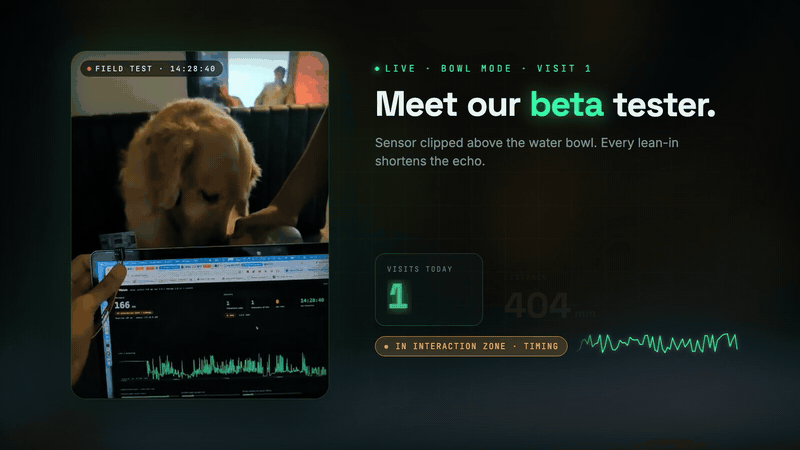
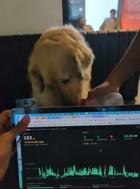
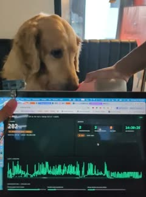
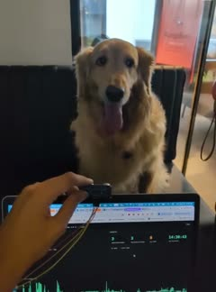
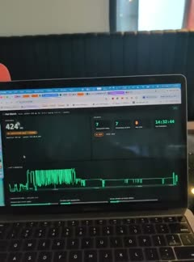
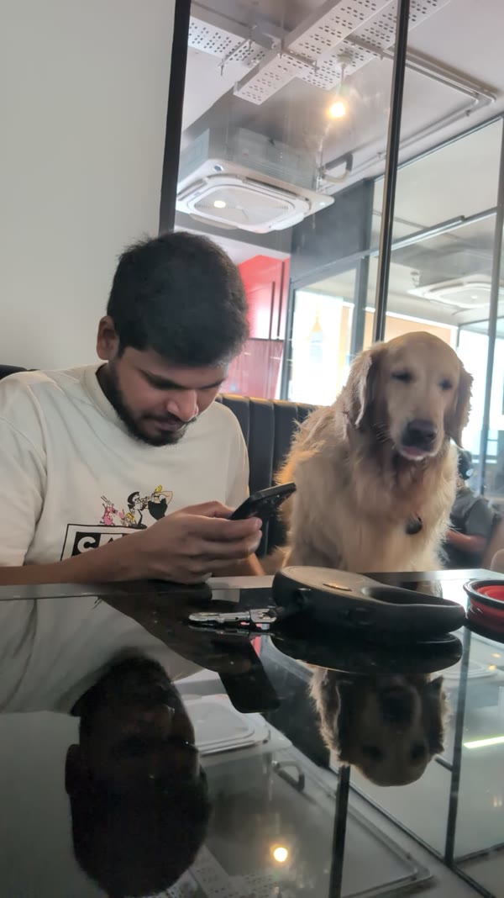

<div align="center">

# 🐾 Pet Watch

### Pets hide illness. Their habits don't.

A **low-cost, non-contact sensor** that logs every visit your pet makes to the litter box or
food bowl, learns that individual's normal rhythm, and flags when it drifts.

[](LICENSE)


[](media/pet-watch-demo.mp4)

**▶ [Watch the full 81-second demo](media/pet-watch-demo.mp4)** · real footage, real sensor, real dashboard

</div>

---

## The demo in one breath

A golden retriever drinks from a bowl. An ultrasonic sensor above it sees the echo
shorten from ~1100 mm to ~160 mm, the live dashboard flips to **"in interaction
zone — timing"**, and the visit counter ticks **1 → 2 → 3**. No camera, no collar,
no cloud. Every visit becomes a row in SQLite, and over days those rows become
*your pet's normal*, so a change stands out long before it's visible.

| Sense | Detect | Learn |
| --- | --- | --- |
| Ultrasonic echo, 20× a second, streamed raw from an ESP32-C6 over ESPHome. | Self-correcting baseline, 1.5 s walk-past filter, fragments merged into one real visit. | Per-pet rhythm by hour of day; an EWMA flags a 2σ drift. Deviation, never diagnosis. |

## Raw footage

The unedited reels behind the demo: one phone, one sensor, one golden retriever.
Timestamps in *What you see* are the dashboard's own clock, so you can check each
count against the frame.

| Clip | What you see |
| --- | --- |
| <a href="media/footage/01-bowl-visit-drinking.mp4"></a><br>**Bowl visit 1: drinking** · 7 s | A teammate holds a water bowl while another holds the ultrasonic sensor at the top of the laptop screen, aimed at the dog. As the head dips in and out, the live distance swings **712 → 163 → 779 → 205 mm** and the badge reads **"in interaction zone · timing"**. Visits today: **1**, logged at **14:28:40**. |
| <a href="media/footage/02-bowl-visit-closeup.mp4"></a><br>**Bowl visit 2: close-up** · 5 s | Tight shot on the dog licking the bowl right above the sensor. The reading hovers at **169–304 mm**, drops to **36 mm** as the snout nudges the transducer, then jumps to **642 mm** as the dog pulls back. Visits: **2**, at **14:30:26**. |
| <a href="media/footage/03-bowl-visit-sit-drink-leave.mp4"></a><br>**Bowl visit 3: sit, drink, leave** · 8 s | The dog sits facing the sensor, is offered the bowl, drinks, and wanders off. The trace shows a dense burst of activity followed by a flat baseline once the dog is gone. Visits: **3**, at **14:30:43**. |
| <a href="media/footage/04-bench-test-full.mp4"></a><br>**Bench test: full take** · 1 min 53 s | The dashboard on its own. **0:00–0:25**: the last-2-minutes chart shows earlier visit bursts while a trig/echo sensor board on jumper wires is held up to the screen. **0:52–1:18**: a second, sealed round ultrasonic probe is waved in front of it. **1:16–1:28**: close-up of the readout: baseline ~140 mm, subject at **163 mm**, **"in interaction zone · timing"**. **1:28–1:50**: the counts panel holds at **7** (last interaction 14:32:44). **~1:50**: a new visit is committed and the counter ticks to **8** at **14:35:03**. |

All four are also cut into the [demo video](media/pet-watch-demo.mp4): visits 1–3 at
0:10–0:30 and the bench test at 0:38–0:59.

## Quick start

```bash
git clone https://github.com/pratiksardar/petWatch && cd petWatch
npm install
npm run verify        # typecheck + 38 tests, no hardware needed
npm run dashboard     # live dashboard on http://localhost:8788
```

Point the dashboard at your device with `PET_WATCH_DEVICE=http://pet-watch.local npm run dashboard`.
Tune detection with `PET_WATCH_INTERACTION_MM` and `PET_WATCH_MIN_S`. Flashing the
device is covered under [Firmware](#firmware); wiring lives in [`docs/wiring.md`](docs/wiring.md).

## Repository map

| Path | What's there |
| --- | --- |
| [`src/`](src) | Streaming visit detector, anomaly layer, rollups, zero-dependency dashboard server. |
| [`test/`](test) | `node:test` golden-file and property tests over synthetic traces. |
| [`firmware/`](firmware) | ESPHome configs for trig/echo and UART ultrasonic sensors. |
| [`docs/`](docs) | Wiring diagrams, level shifting, assembly and pre-power checklist. |
| [`claude-kudos-demo/`](claude-kudos-demo) | The demo video as code: a Remotion project with a storyboard. |
| [`media/`](media) | Rendered demo video, poster, preview GIF, team photo, and the raw footage in `media/footage/`. |

---

## Design notes

> The rest of this README is the engineering write-up: why the parts fit, how the
> detector thinks, and the caveats that will bite you.

**Why this earns its place:** cats in particular hide illness in litter-box
habits. Frequency, duration, and posture changes are the earliest cheap signal
that something is wrong — often days before anything is visible. The device's
job is *not* to diagnose. It is to notice deviation from your pet's own baseline
so you can decide whether to call the vet.

## Why these three parts fit

| Part | Role |
| --- | --- |
| Ultrasonic sensor | The only sense organ. Proximity, dwell time, motion. |
| Dot matrix | The only face. Low-resolution, so use it for *state*, not text. |
| ESP32-C6 | Data collection, plus the 802.15.4 radio for Thread/Matter/Home Assistant. |

The dot matrix is 32×8 pixels. That is not enough for a useful numeric readout
and it *is* enough for eyes, bars, and a 24-hour strip chart. Design around that
instead of fighting it.

## Hardware

| Item | Note |
| --- | --- |
| ESP32-C6 devkit | DevKitC-1 is the default assumption in the firmware. |
| Ultrasonic sensor | Two families, two firmwares. See `docs/wiring.md` §1. |
| **JSN-SR04T** | **Preferred for deployment.** Waterproof, 1 mm resolution, 25–600 cm, sealed transducer on a lead so the board stays outside the box. It is a **UART** device though, so it needs `pet-watch-uart.yaml`, not the trig/echo firmware. |
| **RCWL-1601** | **Least fussy for bench work.** 3.3 V native and trig/echo, so no divider at all. |
| HC-SR04 | Trig/echo. Needs a divider on echo, and has a marginal 3.3 V trigger. See caveats. |
| MAX7219 dot matrix | **Optional — the display is cosmetic.** 4 × 8×8 modules chained = 32×8, which is what the firmware draws. |
| R1 1 kΩ + R2 2 kΩ | The 5 V → 3.3 V divider every 5 V sensor line needs. |
| 470 µF electrolytic | Across the 5 V rail. Brownout headroom — see caveats. |
| Optional: BLE collar beacon | The only real fix for multi-pet disambiguation. |

### Mounting

The two profiles differ enough to be a config switch, not a tweak:

- **LITTER** — probe mounted on the outside of the entry, aimed down and across
  the opening. You are measuring "is something in the doorway/box". Empty reads
  the far wall; occupied reads the pet's back at ~40–60 cm.
- **BOWL** — probe mounted above and slightly behind the bowl, aimed down. Empty
  reads the bowl rim; occupied reads the pet's head and shoulders, and a feeding
  session shows as rhythmic dips as the head raises and lowers.

Never put bare electronics inside the box.

### Wiring


Full diagrams, level shifting, an assembly order, a pre-power checklist, and a
troubleshooting table live in **[`docs/wiring.md`](docs/wiring.md)**. Read §1 and
§8 there before buying a sensor or applying power.

| Signal | C6 GPIO | DevKitC-1 |
| --- | --- | --- |
| Sensor TRIG (or UART TX) | GPIO20 | J3 pin 8 |
| Sensor ECHO (or UART RX) | GPIO21 | J3 pin 7 |
| MAX7219 CLK | GPIO6 | J1 pin 5 |
| MAX7219 DIN | GPIO7 | J1 pin 6 |
| MAX7219 CS | GPIO10 | J1 pin 10 |
| Power | 5 V / GND | J1 pins 14 / 15 |

GPIO4, GPIO5, GPIO8, GPIO9 and GPIO15 are **strapping pins** on the ESP32-C6 and
carry no signals here — their level at reset selects boot and JTAG behaviour.
GPIO8 also drives the on-board RGB LED, GPIO12/13 are USB, and GPIO16/17 are the
serial console.

## Firmware

Two entry points, because the two sensor families are genuinely different
devices:

| File | Sensors | Interface |
| --- | --- | --- |
| `firmware/pet-watch.yaml` | HC-SR04, RCWL-1601, US-100 | trigger/echo |
| `firmware/pet-watch-uart.yaml` | JSN-SR04T, AJ-SR04M | UART 9600 |

Everything they share — power, network, calibration, and debounce — lives in
`firmware/common/base.yaml`, so the two cannot drift apart.

**The display is an optional package**, `common/display-max7219.yaml`, added with
one line. Nothing in `base.yaml` depends on it, so a device with no display still
reports distance, occupancy, and presence. That matters because **ESPHome cannot
drive I2C LED matrices** — there is no HT16K33 component upstream — so an I2C
dot matrix will not work regardless of wiring. See `docs/wiring.md` §13 for the
options.

Either entry point:

1. Streams raw distance at 20 Hz as `distance` (in mm).
2. Computes `occupancy` as 0–100% between two calibrated distances.
3. Derives a debounced `occupied` binary sensor — this is what makes it an
   occupancy device in Home Assistant immediately.
4. Draws eyes and an activity bar on the matrix, graphics only — no font file
   dependency, nothing to break on a fresh flash.
5. Exposes a runtime `occupancy threshold` number so you can tune it from Home
   Assistant without reflashing.

```bash
cd firmware
cp secrets.example.yaml secrets.yaml    # fill in WiFi, api key, ota password
esphome run pet-watch.yaml              # or pet-watch-uart.yaml
```

Generate the API key with `openssl rand -base64 32`.

### Calibration

1. Mount it, pet elsewhere. Watch `distance` in the logs for a minute. Set
   `dist_empty_mm` to that value.
2. Put the pet in position (or hold a cardboard proxy where the pet goes). Read
   `distance` again. Set `dist_full_mm`.
3. Tune the occupancy threshold in Home Assistant from the live chart.

## On-device vs. host

The firmware deliberately does the *least* it can and streams raw distance.
Everything interesting is derived on the host:

- You cannot iterate on a detector that lives in flash without a reflash per
  attempt.
- Raw traces replay through a test harness without the hardware present.
- A threshold in YAML is a threshold you can't tune from the couch.

Move detection back onto the device only when you actually need it — offline
operation, or real-time display reaction. Not before.

## Detector

Input: a series of `(timestamp, distance_mm)` samples at ~20 Hz.

1. **Baseline** — median of a rolling quiet window. This floats, because
   temperature and humidity drift the speed of sound, and litter level drops.
2. **Occupancy** — deviation from baseline beyond a noise-adaptive threshold,
   sustained.
3. **Visit** — a contiguous run of occupancy. Discard runs under ~1.5 s: that's
   a tail swishing past, not a visit.
4. **Features** per visit — duration, min/mean depth, depth spread (how much the
   pet moved), and sample count. Time-of-day and inter-visit intervals belong to
   the rollup layer, not here.
5. **Post-process** — merge fragments separated by a 2–3 s gap; a cat that
   repositions isn't making two visits.

`durationMs` and `depthStdDevMm` are the two features that carry most of the
signal. The first separates a real visit from a walk-past; the second separates
"settled in and using the box" from "circling restlessly", and the restless case
is the one worth noticing.

`src/detector.ts` is a streaming state machine with no hardware, no network, and
no clock reads — `detectVisits()` is a thin array adapter over the same class, so
batch and live use cannot drift apart. That is what makes it testable; see below.

### Two decisions in the detector worth not re-litigating

**The baseline only learns from samples it is confident are empty.** Not from
"samples below the entry threshold". The gap between those two ideas is a
feedback loop: a subject that interrupts the beam only weakly (say 120 mm under
a 150 mm threshold) sits in an ambiguous band, and if those samples train the
baseline then the baseline slides toward the subject, the measured deviation
shrinks along with it, the subject never clears the threshold, and so the
samples stay classified empty and keep dragging the baseline down. The subject
becomes permanently undetectable — and the *quieter* it is, the more thoroughly
it hides. The ambiguous band is therefore evidence of nothing.
`test/detector.test.ts` pins this; with the loop present the baseline converges
onto the subject's own distance (1030 mm instead of 1150 mm).

**The seed baseline errs low, at the 25th percentile.** The asymmetry matters. A
baseline that is too high makes genuinely empty readings look "closer than
empty" — permanently occupied — and nothing can correct it, because adaptation
only ever runs on samples already classified empty. A baseline that is too low
self-corrects within seconds, because empty readings are correctly identified
and pull it upward.

## Data model

```sql
CREATE TABLE visit (
  id            INTEGER PRIMARY KEY,
  device_id     TEXT    NOT NULL,
  pet_id        TEXT,                   -- null when ambiguous
  started_at    TEXT    NOT NULL,
  ended_at      TEXT    NOT NULL,
  duration_ms   INTEGER NOT NULL,
  min_dist_mm   INTEGER NOT NULL,
  mean_dist_mm  REAL    NOT NULL,
  depth_std_dev_mm REAL NOT NULL,
  confidence    REAL    NOT NULL
);

CREATE TABLE daily_rollup (
  device_id     TEXT    NOT NULL,
  pet_id        TEXT,
  day           TEXT    NOT NULL,
  visit_count   INTEGER NOT NULL,
  total_ms      INTEGER NOT NULL,
  overnight_count INTEGER NOT NULL,     -- 00:00-06:00, a real signal
  PRIMARY KEY (device_id, pet_id, day)
);

CREATE TABLE alert (
  id            INTEGER PRIMARY KEY,
  device_id     TEXT    NOT NULL,
  pet_id        TEXT,
  kind          TEXT    NOT NULL,       -- frequency | duration | restlessness | none
  severity      TEXT    NOT NULL,
  raised_at     TEXT    NOT NULL,
  window_start  TEXT    NOT NULL,
  window_end    TEXT    NOT NULL,
  detail_json   TEXT    NOT NULL
);
```

SQLite is enough. There is one sensor.

## AI — three layers, cheapest first

**L1: threshold + debounce.** On-device, in the YAML. Proves the plumbing.

**L2: per-individual anomaly detection.** This is the layer that has value, and
it needs **no labelled data**. For each pet, for each hour-of-day bucket, keep a
rolling mean and standard deviation of visit count and duration. Flag a day when
it deviates beyond ~2σ. Use an EWMA so a week-long illness doesn't get absorbed
into the baseline as "normal".

Start here. This is most of the product.

**L3: supervised classifier.** Only worth it once you have weeks of labelled
trace — you label by reviewing the same week of footage once. Features per visit
as above; logistic regression or a small gradient-boosted tree gets you pet-vs-
human and cat-vs-dog. Don't start here; the labels don't exist yet.

Absolute clinical numbers vary with species, size, age, and medication, so the
system should never assert "normal" or "abnormal" in absolute terms. Frame every
alert as *deviation from this pet's baseline over N days* and leave the judgment
to the owner. Also: a single missed day is noise. Alerting on one-day deviation
will train you to ignore it.

## Running the host project

Node 24 only, and deliberately **zero runtime dependencies**: TypeScript runs
directly via native type stripping (no build step, no `tsx`), tests use the
built-in `node:test`, and storage uses built-in `node:sqlite`. The only
devDependencies are `typescript` and `@types/node`, and only for `tsc --noEmit`.

```bash
npm install
npm run verify     # tsc --noEmit && node --test
npm test
```

| Path | Contents |
| --- | --- |
| `src/detector.ts` | Streaming visit detector: baseline, occupancy, merging, features. |
| `src/stats.ts` | Percentile / median / MAD. Robust by design — see the module note. |
| `src/synthetic.ts` | Deterministic trace generator, so awkward cases are reproducible. |
| `test/` | Golden-file and property tests over generated traces. |
| `firmware/` | ESPHome entry points, plus `common/` shared between both sensor variants. |
| `docs/wiring.md` | Wiring diagrams, level shifting, assembly order, pre-power checklist. |
| `docs/wiring-diagram.svg` | The connection diagram, as editable vector source. |

## Testing without a pet

The single highest-value engineering decision in this project:

**Record real traces once, then replay them forever.** Log raw distance samples
to JSON while your pet uses the box — an hour of footage gives you dozens of
labelled visits. Once you have `traces/*.json` plus expected visit lists, the
entire detector is unit-testable with no hardware, no network, and no pet.

Simulate occupancy on the bench with a book waved at a metronome, or better, a
servo on a flat panel. That validates the wiring; the traces validate the logic.

Until real captures exist, `src/synthetic.ts` covers the cases you cannot stage
on demand — including the ones that only show up over a long run, like a
five-minute visit, 40 mm/min of thermal drift, and a subject hovering exactly on
the detection threshold.

## Milestones

| # | Deliverable | Done when |
| --- | --- | --- |
| 1 | Breadboard bring-up | Distance streams, matrix shows the bar responding. |
| 2 | Mounted + calibrated | `occupied` toggles correctly as the pet comes and goes. |
| 3 | Trace capture | ≥ 20 real labelled visits in `traces/`. |
| 4 | Detector + golden tests | Replaying traces reproduces the labelled visit list. |
| 5 | Host ingest + rollups | Daily counts and durations queryable. |
| 6 | L2 anomaly alerts | A injected-double-frequency synthetic week raises exactly one alert. |
| 7 | Multi-pet | Collar beacon attributes visits; ambiguous visits fall back to `pet_id = null`. |
| 8 | Deployed | Living on the box for 2 weeks with no false-alert storm. |

## Caveats

- **5 V sensor lines need a divider.** Feed an HC-SR04's echo — or a
  JSN-SR04T's TX — straight into the C6's 3.3 V GPIO and you damage the pin,
  often not immediately, which is worse, because it surfaces weeks later as an
  unrelated fault. Two resistors fix it; see `docs/wiring.md` §6. The RCWL-1601
  is 3.3 V native and needs none. This is the most common way to destroy an
  ESP32.
- **Brownouts.** WiFi 6 transmit bursts plus a fully lit matrix will brown out a
  weak USB port, and the symptom is random reboots that look like firmware bugs.
  Use a 2 A supply and a bulk capacitor across the 5 V rail.
- **Don't over-poll the ultrasonic.** Continuous 40 kHz bursts near a pet is
  avoidable noise exposure — it's inaudible to you and loud to them. 20 Hz in
  short bursts is fine; drop to 5 Hz while idle.
- **One sensor, one beam.** It cannot tell a cat from a small dog from a large
  cat at range. Posture and dwell time are weak proxies. Collar beacons are the
  real answer, and until then leave `pet_id` null rather than guess.
- **Known ESPHome issue:** HC-SR04 on ESP32 had a `pulse end before pulse start`
  regression in some 2025.1.x releases. Pin your ESPHome version. The UART
  sensors use a different component and sidestep it entirely.
- **Matrix drawing primitives** (`filled_rectangle` etc.) are version-sensitive
  across ESPHome releases, being the newest part of the display API. If the
  lambda fails to compile, that's the line to check, and falling back to
  `it.print()` with a font fixes it.

## Team

<p align="center">
  <br>
  <sub>The humans who built it, and the Chief Testing Officer who signed off on every visit.</sub>
</p>

## Contributing

Issues and pull requests are welcome, especially real captured traces (see
[Testing without a pet](#testing-without-a-pet)), new sensor variants, and
multi-pet attribution. Start with [CONTRIBUTING.md](CONTRIBUTING.md).

## License

[MIT](LICENSE) © 2026 Pratik. The demo video in `media/` and its source in
`claude-kudos-demo/` are released under the same license. Remotion, used to render
the video, is licensed separately; see [remotion.dev/license](https://remotion.dev/license).
