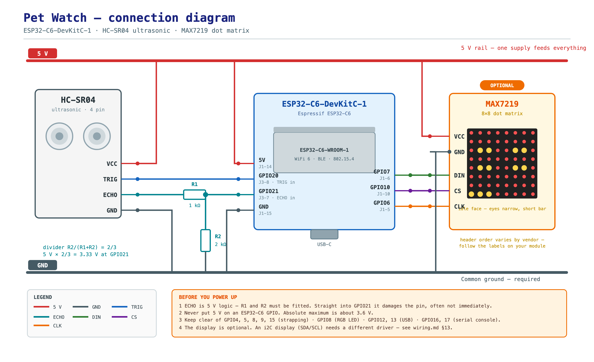

# Wiring & assembly

Everything needed to go from three parts on a desk to a working device, and the
reasons behind each connection. Read §1 before buying a sensor and §8 before
applying power — those two sections are where builds get destroyed.

Board references throughout are to the **ESP32-C6-DevKitC-1 v1.2**, where the
headers are named J1 (the long side) and J3 (the short side). Pin numbers are the
physical positions, so they match the silkscreen.

## The diagram



Source is `docs/wiring-diagram.svg` (editable, vector); the PNG above is a 2×
render of it. It shows the whole build on one page: both power rails, the
HC-SR04, the ESP32-C6, the MAX7219, and the R1/R2 divider on the echo line.

**Lines that cross without a junction dot are not connected.**

Three notes on reading it:

- The display is drawn with its header pins in the electrical order the signal
  runs reach them. Header order genuinely varies between vendors, so wire by the
  **labels printed on your module**, not by position on this drawing.
- The diagram shows a single 8×8 module. For a 4-in-1 (32×8) board the signals
  are identical; only the chaining in §4 is additional.
- `R1`/`R2` are the divider. With an RCWL-1601 (3.3 V native) you omit both and
  wire ECHO straight through.

---

## 1. First, which sensor do you actually have?

This matters more than anything else here, because the two families need
**different firmware and different wiring**.

| Sensor | Interface | Firmware | Waterproof |
| --- | --- | --- | --- |
| HC-SR04 | trig/echo | `pet-watch.yaml` | no |
| RCWL-1601 | trig/echo | `pet-watch.yaml` | no |
| US-100 | trig/echo or UART | `pet-watch.yaml` | no |
| **JSN-SR04T** | **UART 9600** | **`pet-watch-uart.yaml`** | **yes** |
| AJ-SR04M | UART 9600 | `pet-watch-uart.yaml` | yes |

**How to tell:** look at the 4-pin header on the driver board.

- Labelled `VCC / GND / TRIG / ECHO` → trig/echo. Use `pet-watch.yaml`.
- Labelled `VCC / GND / TX / RX` → UART. Use `pet-watch-uart.yaml`.

The JSN-SR04T is the one to deploy in a litter box — it is the only waterproof
option, and it keeps its transducer on a sealed lead so the electronics can live
outside the box. But it is genuinely a serial device, and **it will not work with
trig/echo firmware**.

Two further JSN-SR04T gotchas worth knowing before you order one:

- **Mode selection is a physical resistor you may have to add.** Mode 1 (module
  free-runs, ~100 ms) needs 47 kΩ on pad R27; mode 2 (you poll with `0x55`)
  needs 120 kΩ on R27. On v3.0 boards these are the `M1`/`M2` solder pads
  instead. Some boards ship with one fitted, some ship with neither.
- **It wants 5 V, not 3.3 V.** 3.3 V operation is reported as spotty. Power it
  from 5 V and treat its TX line as 5 V logic (§6).

For bench work today, the **RCWL-1601 is the least fussy** choice: 3.3 V native,
trig/echo, no divider at all. An HC-SR04 works too but needs the divider and has
a marginal trigger (§6).

---

## 2. Parts

| Part | Note |
| --- | --- |
| ESP32-C6-DevKitC-1 | |
| Ultrasonic sensor | See §1. |
| MAX7219 8×8 dot matrix, ×4 | Chained to make 32×8. |
| 5 V / 2 A supply | USB-C is fine to start; see §3. |
| **R1 = 1 kΩ, R2 = 2 kΩ** | The echo/TX divider. Two resistors, any ¼ W. |
| Electrolytic cap, 470–1000 µF | Across 5 V near the display. Not optional. |
| 0.1 µF ceramic, ×1–4 | Per module decoupling, if you have them. |
| Level shifter (74AHCT125 or similar) | Only if you hit the marginal-logic symptoms in §9. |
| Jumper wires, breadboard | |

---

## 3. Power architecture

Two rules, and the second one is what people get wrong:

1. **Nothing runs from the 3V3 pin.** The MAX7219 needs 5 V, the sensor wants
   5 V, and the devkit's 3.3 V regulator is not sized for a display.
2. **Every device shares one ground.** Logic levels are measured against it. A
   display with its own ground reference will produce garbage.

```
   5 V / 2 A                        ESP32-C6-DevKitC-1
   supply                          ┌────────────────────┐
      │                            │                    │
      ├────── 5 V ─────────────────┤ J1-14   5V         │
      │                            │                    │
      ├────── GND ─────────────────┤ J1-15   GND        │
      │                            │                    │
      ├────── 5 V ──┬──────────────┤                    │
      │             │              │           3V3 ─────┼── leave free, or use it
      │             │              │                    │   only for a logic-level
      │             │              └────────────────────┘   reference
      │             │
      │             ├── MAX7219 #1 VCC ── #2 VCC ── #3 VCC ── #4 VCC
      │             └── sensor VCC
      │
      └────── GND ──┬── MAX7219 #1 GND ── #2 GND ── #3 GND ── #4 GND
                    └── sensor GND

   ┌──────────┐
   │ 470 µF + │  physically near the display, across 5 V and GND
   └──────────┘
```

**Why the capacitor.** Four MAX7219 modules lighting up at once draw a current
step, and a weak USB port sags under it. The result is random reboots and
half-lit pixels that look exactly like firmware bugs. The bulk cap absorbs the
transient. The firmware also runs the display at `intensity: 6` of 15 for the
same reason.

---

## 4. Wiring the display (MAX7219 over SPI)

> **Read §13 first if your display has 4 pins.** MAX7219 modules are 5-pin SPI
> devices. A 4-pin display labelled `VCC / GND / SDA / SCL` is I2C, ESPHome
> cannot drive it, and nothing on this page applies to it.

Grab the whole chain before connecting anything to the ESP32. You are building
one 32×8 panel out of four 8×8 modules.

```
  ESP32-C6                      M1 (8x8)    M2 (8x8)    M3 (8x8)    M4 (8x8)
  ─────────                     ────────    ────────    ────────    ────────
  GPIO7  J1-6  ──── DIN ──────►  DIN
  GPIO6  J1-5  ──── CLK ──────►  CLK ──────► CLK ──────► CLK ──────► CLK
  GPIO10 J1-10 ──── CS  ──────►  CS  ──────► CS  ──────► CS  ──────► CS
                                  DOUT ─────► DIN
                                              DOUT ─────► DIN
                                                          DOUT ─────► DIN
  5 V           ──── VCC ─────►  VCC ──────► VCC ──────► VCC ──────► VCC
  GND           ──── GND ─────►  GND ──────► GND ──────► GND ──────► GND
```

Three things that go wrong here:

- **The chain is directional.** Each module has an IN side and an OUT side.
  `DIN` must be fed from the ESP32 on module 1, and each module's `DOUT` feeds
  the next module's `DIN`. Feed the OUT side and nothing lights.
- **Vendor header order varies.** Most modules are `VCC GND DIN CS CLK` but not
  all, and a couple use a different order entirely. Read your module's
  silkscreen rather than trusting this diagram for the pin order — trust it only
  for *which signals go where*. Getting VCC and GND backwards is the fastest way
  to kill all four modules at once.
- **Orientation is a firmware detail.** Depending on which way you route the
  cable, the 32-pixel axis may come out mirrored. That is what `flip_x` is for
  in `common/base.yaml`; it is not a wiring fault.

---

## 5. Wiring the sensor

### 5a. Trigger/echo variant

Firmware: `firmware/pet-watch.yaml`

```
  HC-SR04 / RCWL-1601             ESP32-C6-DevKitC-1
  ┌────────────────┐              ┌────────────────────┐
  │                │              │                    │
  │  VCC ──────────┼──────────────┤ J1-14   5V         │
  │  GND ──────────┼──────────────┤ J1-15   GND        │
  │  TRIG ◄────────┼──────────────┤ J3-8     GPIO20    │
  │  ECHO ────┐    │              │ J3-7     GPIO21    │
  └───────────┼────┘              │                    │
              │                   │                    │
           ┌──┴──┐  R1  1 kΩ      │                    │
           └──┬──┘                │                    │
              ├───────────────────┤  GPIO21  (echo in) │
           ┌──┴──┐  R2  2 kΩ      │                    │
           └──┬──┘                │                    │
             GND ─────────────────┤  GND               │
                                  └────────────────────┘

  ECHO swings to 5 V.  R1 and R2 divide it to 5 × 2/(1+2) = 3.33 V.
  Never connect ECHO straight to a GPIO.
```

An **RCWL-1601 needs no divider** — it is 3.3 V native, so wire its ECHO pin
directly to GPIO21 and drop R1 and R2. The diagram's divider is for a 5 V sensor.

### 5b. UART variant

Firmware: `firmware/pet-watch-uart.yaml`

```
  JSN-SR04T / AJ-SR04M            ESP32-C6-DevKitC-1
  ┌────────────────┐              ┌────────────────────┐
  │                │              │                    │
  │  VCC ──────────┼──────────────┤ J1-14   5V         │
  │  GND ──────────┼──────────────┤ J1-15   GND        │
  │  RX  ◄─────────┼──────────────┤ J3-8     GPIO20    │
  │  TX  ─────┐    │              │ J3-7     GPIO21    │
  └───────────┼────┘              │                    │
              │                   │                    │
           ┌──┴──┐  R1  1 kΩ      │                    │
           └──┬──┘                │                    │
              ├───────────────────┤  GPIO21  (UART RX) │
           ┌──┴──┐  R2  2 kΩ      │                    │
           └──┬──┘                │                    │
             GND ─────────────────┤  GND               │
                                  └────────────────────┘

  Wire BOTH data lines. The module's TX needs the divider; its RX is an input,
  so the ESP32's 3.3 V is fine to drive directly.
```

The divider is on **TX only** — the ESP32's 3.3 V output driving the module's RX
input needs no shifting, because 3.3 V is above the module's input-high
threshold. Only the module's 5 V output needs stepping down.

---

## 6. Why the divider, and why the trigger is "marginal"

**The echo/TX line.** The ESP32-C6's GPIOs are not 5 V tolerant. Absolute
maximum is roughly 3.6 V, and a 5 V logic high on a GPIO damages the pin — often
not instantly, which is worse, because it fails weeks later and looks like an
unrelated fault. Two resistors fix it:

```
Vout = 5 V × R2 / (R1 + R2) = 5 × 2000 / 3000 = 3.33 V
```

Any pair with `R2/(R1+R2) ≈ 0.66` works. 1 kΩ and 2 kΩ is the standard pairing
and lands at 3.33 V, comfortably inside the pin's rating.

A resistor divider is genuinely the *right* answer for a one-way 5 V → 3.3 V
step-down like this — cheaper and more reliable than a bidirectional level
shifter module, many of which are unhappy driving a line that toggles as fast as
an echo pulse. If you would rather not solder, a BSS138-based shifter module is
fine; avoid TXS0108E-class auto-direction parts here.

**The trigger line.** The HC-SR04 runs its logic at 5 V and its trigger
threshold sits around 0.6 × VCC ≈ 3 V. The ESP32 puts out 3.3 V, so it usually
works — but it is close enough to the edge that some individual units ignore it,
and it gets worse as the sensor ages or runs cold. Two ways out:

- If your HC-SR04 triggers reliably, leave it. Test it before relying on it.
- If it does not, buffer the trigger: a **74AHCT125** powered from 5 V has
  TTL-level inputs, so it accepts 3.3 V happily and outputs a clean 5 V. It can
  drive the trigger as well as the display's logic lines, so one chip covers
  both marginal cases.
- Or sidestep it entirely with a 3.3 V-native sensor (RCWL-1601).

**The display's logic lines.** MAX7219's input-high threshold is 0.7 × VCC =
**3.5 V** when powered at 5 V, while the ESP32 drives 3.3 V. This is genuinely
below spec, and in practice it almost always works. If it does not, the symptom
is not "nothing happens" but *garbled, shifted, or randomly flickering pixels* —
which reads like a software bug. The same 74AHCT125 fixes it properly. Do not
try to fix it by powering the MAX7219 at 3.3 V: that is below its 4.0 V minimum
and will just be dim and unreliable.

---

## 7. Assembly order

Build in this order and test between steps. Each step is independently
verifiable, so a fault is isolated to the thing you just added.

1. **Nothing connected.** Flash the firmware. Confirm it boots, joins WiFi, and
   appears in Home Assistant. The display and sensor will report nothing — that
   is expected.
2. **Display only.** Wire §4. Watch the eyes appear. Tune `intensity` and
   `flip_x` in `common/base.yaml` now, while it is easy.
3. **Sensor, unpowered check first.** Build the divider, then do §8's resistance
   check before connecting it to the GPIO.
4. **Sensor powered.** Wire §5. Watch `distance` in the logs.
5. **Calibrate** (§9) and mount it.

---

## 8. Pre-power checklist

Do this with a multimeter. It takes two minutes and prevents the two mistakes
that cost real hardware.

1. **Continuity, power off.** Probe 5 V to GND on the rail. It must **not**
   beep. A beep means a short, and powering up will kill something.
2. **Divider resistance, sensor unpowered.** With the divider built but its
   output not yet on the GPIO, measure:
   - from the divider output node to **GND** → should read **2 kΩ**
   - from the divider output node to the sensor's **ECHO/TX pin** → **1 kΩ**

   If those two readings are right, the divider is correct and the output can
   only ever be ~3.33 V. Verify *before* connecting it, not after.
3. **Rail voltage, power on, sensor and display disconnected.** 5 V pin should
   read **4.9–5.1 V**. If it reads below 4.7 V, your supply is too weak — fix
   that before adding load.
4. **Only then** connect the display, then the sensor.

---

## 9. First boot and calibration

```bash
cd ~/code/pet-watch/firmware
cp secrets.example.yaml secrets.yaml     # fill in WiFi, api key, ota password
esphome run pet-watch.yaml
esphome logs pet-watch.yaml
```

Generate the API key with `openssl rand -base64 32`.

Then, watching `distance` in the logs:

1. **Empty box.** Note the stable reading. Put it in `dist_empty_mm`.
2. **Pet in place**, or a cardboard proxy where the pet goes. Note that
   reading. Put it in `dist_full_mm`.
3. Reflash, and tune the *occupancy threshold* from Home Assistant on the live
   chart — it is a `number` entity, so no reflash needed.

Sanity check: with the box empty, `occupancy` should sit near 0 and the eyes
should be narrow. Put your hand in the beam and it should reach high and the
eyes should open wide.

---

## 10. Mounting for the box

**Never put the electronics inside the litter box.** Ammonia, dust, and humidity
destroy boards, and it is why the JSN-SR04T's remote transducer matters — the
sealed probe goes near the box, the board stays outside it.

- **Litter:** probe on the outside of the entry, aimed down and across the
  opening. Empty reads the far wall; occupied reads the pet at 40–60 cm.
- **Bowl:** probe above and slightly behind the bowl, aimed down. Empty reads
  the bowl rim; feeding shows as rhythmic dips as the head raises and lowers.

Point the transducer away from soft furnishings and the litter surface itself —
those scatter instead of reflecting. Keep the beam clear of anything that moves
on its own.

Run the cable so it cannot be chewed, and mount the probe rigidly: a sensor that
can wiggle will register its own movement as visits.

---

## 11. Troubleshooting

| Symptom | Likely cause |
| --- | --- |
| Nothing lights on the display | Chain fed from the OUT side. DIN must go to module 1's IN side. |
| Pixels garbled, shifted, or flickering | MAX7219 logic level. See §6 — add a 74AHCT125. |
| Only some modules light | A DOUT→DIN link is wrong or a module's power is not shared. |
| Random reboots under load | 5 V rail sagging. Add the bulk capacitor, lower `intensity`, use a bigger supply. |
| `distance` always `nan` | No echo. Check the divider, the trigger voltage (§6), and that TRIG/ECHO are not swapped. |
| `distance` reads a constant nonsense value | Echo floating or divider mis-wired. Redo §8 step 2. |
| `distance` reads ~0 constantly | Transducer against a surface, or VCC/GND reversed. |
| UART sensor silent | Wrong entry point — JSN-SR04T needs `pet-watch-uart.yaml`; also check the mode-select resistor (§1). |
| Build fails: `require_tx` | UART variant needs **both** TX and RX wired. |
| Device won't boot at all, or boots into download mode | Something is driving a strapping pin (GPIO4/5/8/9/15) at boot. Move it. |
| Occupancy flips constantly with nothing there | Recalibrate `dist_empty_mm`, and lower the threshold slider in Home Assistant. |
| Occupancy never triggers | `dist_empty_mm` and `dist_full_mm` are the same or inverted. |
| Eyes never open | Threshold too high, or the sensor is aimed off the target. |

---

## 12. Reserved pins, for reference

Do not put a sensor or display line on these.

| GPIO | Why |
| --- | --- |
| 4, 5 | Strapping (MTMS/MTDI) — level at reset selects JTAG behaviour |
| 8 | Strapping **and** the on-board addressable RGB LED |
| 9 | Strapping, and the BOOT button |
| 15 | Strapping |
| 12, 13 | USB D-/D+ |
| 16, 17 | U0TXD/U0RXD — the serial console used for logging |
| 24–30 | SPI flash, not broken out |

Pins this build uses: **GPIO20** and **GPIO21** for the sensor, **GPIO6/7/10**
for the display. GPIO6 and GPIO7 are the chip's hardware FSPICLK/FSPID, which is
the cleanest routing for SPI.

---

## 13. Displays: what works and what doesn't

**The display is optional.** Nothing in `common/base.yaml` depends on it, so a
device with no display at all still reports distance, occupancy, and presence,
and still feeds the host detector. If you are unsure which display to use, build
without one first — you lose only the eyes.

### What ESPHome can drive natively

| Display | Interface | ESPHome platform |
| --- | --- | --- |
| MAX7219 dot matrix | SPI | `max7219digit` |
| SSD1306 / SH1106 OLED | I2C or SPI | `ssd1306_i2c`, `ssd1306_spi` |
| LCD (HD44780) | I2C or parallel | `lcd_pcf8574`, `lcd_gpio` |
| HUB75 RGB matrix | parallel | `hub75` |
| TM1637 7-segment | 2-wire | `tm1637` |

### What it cannot: HT16K33

Most I2C LED dot-matrix backpacks — Adafruit's, Keyestudio's, the generic
"8×8 I2C dot matrix" boards — use an **HT16K33** driver, and **ESPHome has no
component for it.** Verified rather than assumed:

- `esphome/components/ht16k33` does not exist upstream.
- The display documentation lists character, serial, and graphical platforms,
  and HT16K33 is not among them.
- An ESPHome feature request asking for Adafruit HT16K33 support has been open
  since 2020.
- No maintained community external component surfaced in a search either.

If your display is one of these, it will not work with the firmware as written,
regardless of how it is wired.

### Your options

| | Approach | Cost | Trade-off |
| --- | --- | --- | --- |
| **A** | **Skip the display** | free | You lose the eyes. Everything else works today. |
| **B** | **Buy a MAX7219 module** (5-pin, SPI) | a couple of dollars | Cheapest real fix; every config and diagram here already matches it. |
| **C** | **Write an ESPHome external component** for HT16K33 | real work | Keeps the display you have. Needs ~200 lines of C++ implementing a `DisplayBuffer` over I2C, and hardware to test it against. Doable, not free. |
| **D** | **Drop ESPHome, use Arduino + `Adafruit_HT16K33`** | large | The library is mature, but you lose OTA, the native Home Assistant API, and the whole `firmware/` tree has to be rewritten. |

**Recommendation: A now, then B.** The display is decoration; the value of this
project is the visit logging and the drift detection behind it, none of which
needs a pixel.

### If you are wiring an I2C display anyway

The wiring is worth doing even if the driver is unresolved, because option C or
D needs it.

| I2C display | ESP32-C6 | DevKitC-1 |
| --- | --- | --- |
| VCC | 3V3 | J1 pin 1 — **see the warning below** |
| GND | GND | J1 pin 15 |
| SDA | GPIO22 | J3 pin 6 |
| SCL | GPIO23 | J3 pin 5 |

Both are outside the reserved set, so they are safe. The HT16K33 answers on I2C
address `0x70`.

**The 5 V trap.** Most HT16K33 boards carry their own I2C pull-up resistors wired
to the board's `VCC`. Power that board from 5 V and it pulls SDA and SCL up to
5 V — straight into your 3.3 V GPIOs, with the same delayed damage as an
unshifted echo line.

- Power the board from **3V3** (J1 pin 1) if it tolerates it. The LEDs run
  dimmer, which for a 64-pixel status face is fine.
- If it must have 5 V, level-shift SDA and SCL, or at minimum confirm with a
  multimeter that the bus idles at 3.3 V before connecting the ESP32.
- Many modules already include the pull-ups. If yours does not, add 4.7 kΩ from
  each line to 3V3 — and still to 3V3, never 5 V.
